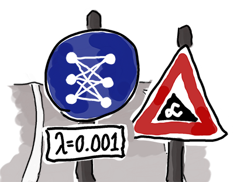

# Self Driving Car Engineer Project 2 - Traffic Sign Recognition
## Benjamin Söllner, 27 Apr 2017

---

---

The goals / steps of this project are the following:
* Write a [python notebook](Traffic_Sign_Classifier.ipynb)
that realizes a neural network for classifying images of german traffic signs.
  * Load the data set (see below for links to the project data set)
  * Explore, summarize and visualize the data set
  * Design, train and test a model architecture
  * Use the model to make predictions on new images
  * Analyze the softmax probabilities of the new images
* Summarize the results with a [written report](writeup.md).

Some images from the web were used in this project. Find the license in
[LICENSE.md](LICENSE.md).
