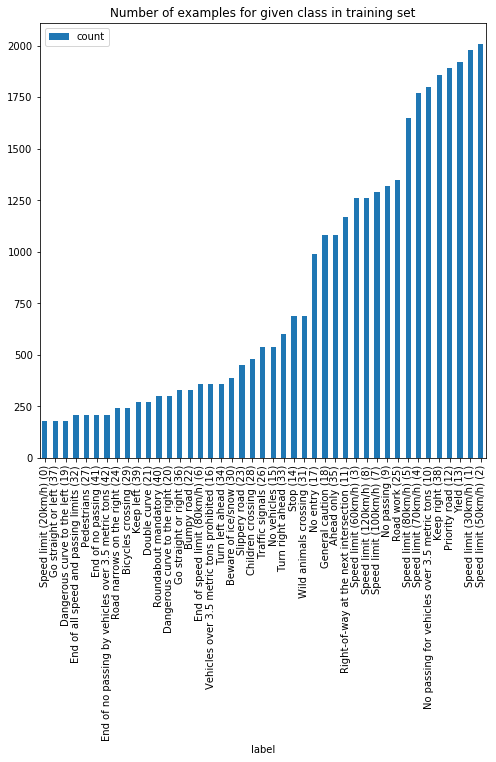
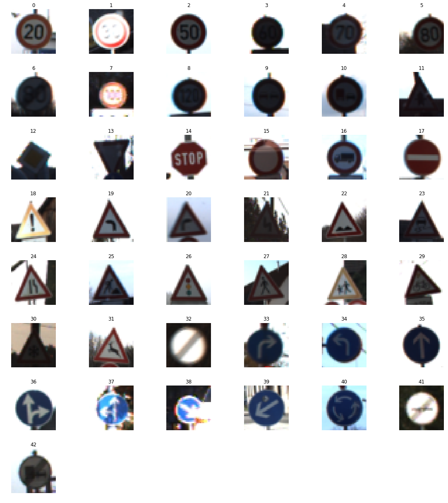
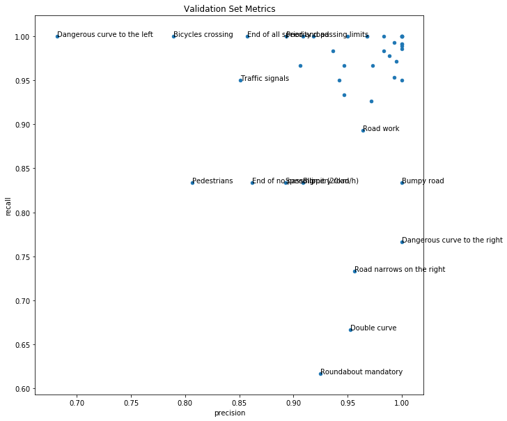
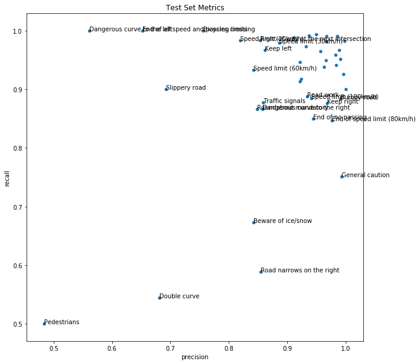
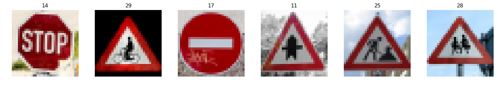
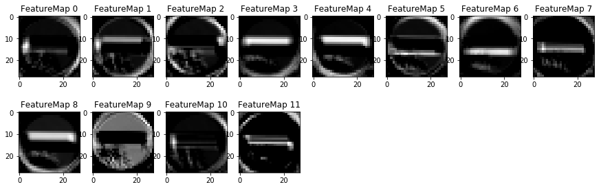
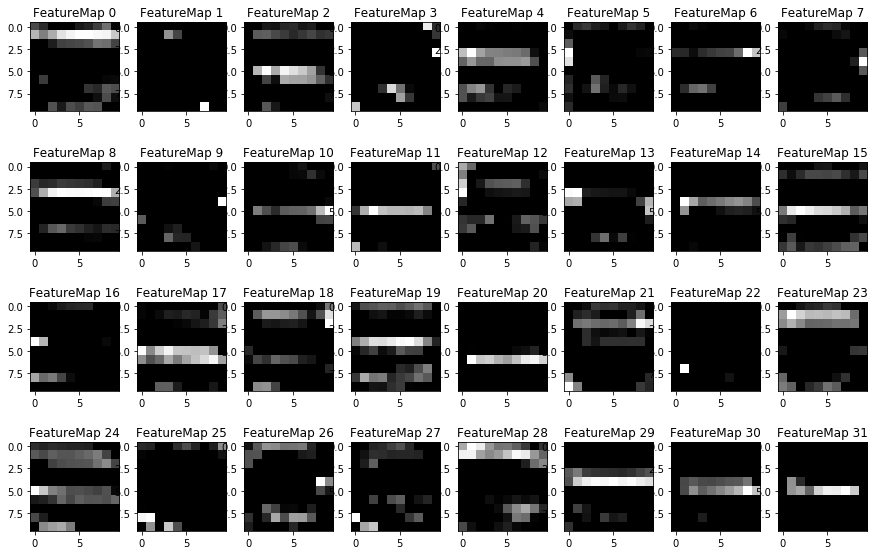

# Self Driving Car Engineer Project 2 - Traffic Sign Recognition
## Benjamin Söllner, 27 Apr 2017

---


---

The goals / steps of this project are the following:
* Load the data set (see below for links to the project data set)
* Explore, summarize and visualize the data set
* Design, train and test a model architecture
* Use the model to make predictions on new images
* Analyze the softmax probabilities of the new images
* Summarize the results with a written report

## Rubric Points

Here I will consider the [rubric points](https://review.udacity.com/#!/rubrics/481/view) individually and describe how I addressed each point in my implementation.  


### Writeup / README

**1. Provide a Writeup that includes all the rubric points and how you addressed each one. You can submit your writeup as markdown or pdf. You can use this template as a guide for writing the report. The submission includes the project code.**

You're reading it! and here is a link to my [project code](https://github.com/benjaminsoellner/CarND_02_TrafficSignClassifier/blob/master/Traffic_Sign_Classifier.ipynb)


### Data Set Summary & Exploration

**1. Provide a basic summary of the data set. In the code, the analysis should be done using python, numpy and/or pandas methods rather than hardcoding results manually.**

I used the pandas library to calculate summary statistics of the traffic
signs data set:

```
Number of training examples = 34799
Number of validation examples = 4410
Number of testing examples = 12630
Image data shape = (32, 32)
Number of classes = 43
```

Taking into consideration the pre-processing techniques additional data
was generated in the training set so in total ``86430`` images were trained.


**2. Include an exploratory visualization of the dataset.**

The following bar chart contains the number of samples for each class /
label. The class with the highest number of samples has about 10x as many
instances as the class with the lowest number of samples.



Below, find example images for each class. The images were chosen by
selecting the images with highest contrast. As contrast metric, the
standard deviation of the distribution of grayscale-values in the
image was used, with a high standard deviation representing high contrast.




## Design and Test a Model Architecture

**1. Describe how you preprocessed the image data. What techniques were
chosen and why did you choose these techniques? Consider including images
showing the output of each preprocessing technique. Pre-processing refers to
techniques such as converting to grayscale, normalization, etc.** (optional:
As described in the "Stand Out Suggestions" part of the rubric, if you
generated additional data for training, describe why you decided to generate
additional data, how you generated the data, and provide example images of
the additional data. Then describe the characteristics of the augmented
training set like number of images in the set, number of images for each
class, etc.)

The data was pre-processed in the following fashion:
* Images were converted to gray-scale by using the ``cv2.cvtColor(x, cv2.COLOR_RGB2GRAY)`` function
* Images were normalized to posess zero mean & standard-deviation 1 (``x-128/128``).
* In order to achieve lower bias of the training algorithm towards one
class or another, the training set was "equalized" in order to contain
the same number of images for each class. For the classes with lower
number of samples, values were picked multiple times at random (with
replacement) and added to the training set. The additional images
were not modified and therefore could end up multiple times in the
training set. A potential improvement for the algorithm would be
to add distortions, translations or slight re-scaling to these images.


**2. Describe what your final model architecture looks like including model
type, layers, layer sizes, connectivity, etc.) Consider including a diagram
and/or table describing the final model.**

My final model consisted of the following layers:

| Layer         		| Output Dim. |          Additional Settings            |
|:-----------------:|:-----------:|:---------------------------------------:|
| Input         		| 32x32x1     |                                         |
| Convolution 5x5   | 28x28x12    | 1x1 stride, valid padding               |
| ReLU              | 28x28x12    |                                         |
| Max Pooling	      |	14x14x12    | 2x2x1 stride, valid padding             |
| Convolution 5x5   | 10x10x32    | 1x1 stride, valid padding               |
| ReLU              | 10x10x32    |                                         |
| Max Pooling       | 5x5x32      | 2x2x1 stride, valid padding             |
| Flatten           | 800         |                                         |
| Fully connected   | 400         | dropout trained with ``keep_prob=0.75`` |
| ReLu              | 400         |                                         |
| Fully connected   | 240         | dropout trained with ``keep_prob=0.75`` |
| ReLu              | 240         |                                         |
| Fully connected   | 166         |                                         |
| ReLu              | 166         |                                         |
| Fully connected   | 43 (number of classes)  |                             |
| ReLu              | 43          |                                         |
| Softmax				    | 43 (one-hot encoded)    |                            ||


**3. Describe how you trained your model. The discussion can include the type
of optimizer, the batch size, number of epochs and any hyperparameters such
as learning rate.**

* The optimized cost function was the reduce-mean of the cross-entropy
between the predicted one-hot-encoded values and the one-hot encoded values
of the training set
(``tf.reduce_mean(tf.nn.softmax_cross_entropy_with_logits(...))``)
* As an optimizer the ``tf.nn.AdamOptimizer(...)`` was chosen, a stochastic
version of Gradient Descent
* The model was trained for 10 Epochs with a learning rate of 0.001 and a
batch size of 128. These hyperparameters were kept from the
LeNet-architecture.

**4. Describe the approach taken for finding a solution and getting the
validation set accuracy to be at least 0.93. Include in the discussion the
results on the training, validation and test sets and where in the code these
were calculated.** Your approach may have been an iterative process, in which
case, outline the steps you took to get to the final solution and why you
chose those steps. Perhaps your solution involved an already well known
implementation or architecture. In this case, discuss why you think the
architecture is suitable for the current problem.

My final model results were:
* training set accuracy of ``0.998``
* validation set accuracy of ``0.956`` (F1-score: ``0.955``)
* test set accuracy of ``0.925`` (F1-score: ``0.926``)

The F1-score was calculated as a weighted average across all classes taking
into consideration the number of instances in each class.

Using the confusion matrix, we can also use at which classes get often
mixed up with each other. We can see, that especially different speed
limits and different "caution" sings get mixed up (\*). My assumption is that
the neural network does not stike a very good balance between recognizing
the "big picture" first (whether a sign is a caution sign, i.e., triangular
or a speed limit sign etc.) and then using a higher level of detail to
analyze the center of such a "super-class" of traffic signs.

During design of the model, the following steps were implemented/considered:
1. Started with the LeNet architecture from the lab and achieved validation
accuracy of ca. 0.89
2. Added grayscale & normalization pre-processing and achieved validation
accuracy of 0.90
3. Added double-depth of the last layer increased training accuracy (0.99)
but did not increase validation accuracy (0.90) - we were overfitting
4. Added dropout before the final classification layer with
``keep_prob=0.8``. This led to a nice increase of validation accuracy to 0.93
5. Decreasing ``keep_prob`` to ``0.6`` did not provide any noticable change.
6. An idea to only use contrast-rich images for training led to massive
overfitting (training accuracy: 0.84, validation accuracy: 0.57), probably
in part because high-contrast images are sometimes so under-/overexposed due
to contrast with the background that the actual sign is barely recognizable
(see sample images).
7. Increasing the depth of the initial convolution layer and adding two
fully connected layer to narrow down results, one of them also with
dropout (now both dropout layers with ``keep_prob=0.75``) led to the
current result. The rationale for this improvement was the realization that
traffic signs should be much more complex than the handwritten numbers
from the LeNet-dataset and should contain many more detailed features that
could be recognized by a higher output depth of the convolutional layer.

Here is a visualization of the most problematic classes (labeled) that the
model seems to be having most trouble with in the validation and test set.
Triangle-shaped traffic signs with rather small icons in the center (e.g.,
pedestrian, traffic signal, curve, double curve) seem consistently
problematic.





**Idea for future work:** Perhaps a very different model architecture, where
one essentially uses two "sub-networks", one running on a low-resolution
version of the whole image, one running on a fine-grained version of the
image's center-area, could do the job. Both "sub-networks" could then be
interconnected via one or more fully-connected layers. The coarse-grained
sub-network could also take into consideration color perception since some
of the mis-classifications mix up different super-classes (e.g. priority
road and roundabout), that could be easily distinguishable by color. (\*\*)

For the validation set we get:

| Rank | Actual class | Predicted class | Number of wrong predictions |   |
|:----:|:------------:|:---------------:|:---------------------------:|:-:|
| 1	   | Roundabout mandatory |	Priority road	                | 21 | (**) |
| 2    | Speed limit (80km/h) | Speed limit (50km/h)          |  9 | (*)  |
| 3    | Double curve         | Dangerous curve to the left	  |  7 | (*)  |
| 4    | Double curve         | Wild animals crossing         |  7 | (*)  |
| 5	   | Bumpy road           | Bicycles crossing             |  6 | (*)  |

For the test set we get:

| Rank | Actual class | Predicted class | Number of wrong predictions |   |
|:----:|:------------:|:---------------:|:---------------------------:|:-:|
| 1    | Keep right                | Speed limit (30km/h)     | 32 | (*)  |
| 2    | Speed limit (100km/h)     | Speed limit (120km/h)	  | 30 | (*)  |
| 3    | Double curve              | Slippery road            | 29 | (*)  |
| 4    | Road narrows on the right | Bicycles crossing        | 21 | (*)  |
| 5    | Road work  | Right-of-way at the next intersection	  | 21 | (**) |


### Test a Model on New Images

**1. Choose five German traffic signs found on the web and provide them in the report. For each image, discuss what quality or qualities might be difficult to classify.**

Here are five German traffic signs that I found on the web ([license](https://github.com/benjaminsoellner/CarND_02_TrafficSignClassifier/blob/master/LICENSE.md)):



The second (29) and the last (28) images could be especially hard to classify
since especially the details in the center are very hard to recognize because
of the low resolution.

**2. Discuss the model's predictions on these new traffic signs and compare the results to predicting on the test set. At a minimum, discuss what the predictions were, the accuracy on these new predictions, and compare the accuracy to the accuracy on the test set.** (optional: Discuss the results in more detail as described in the "Stand Out Suggestions" part of the rubric).

Here are the results of the prediction:

| Image class       | Predicted class                       |      |
|:-----------------:|:-------------------------------------:|:----:|
| Stop              | Stop                                  |      |
| Bicycles crossing | Right-of-way at the next intersection | (\*) |
| No entry          | No entry                              |      |
| Right-of-way at the next intersection | Right-of-way at the next intersection |  |
| Road work         | Road work                             |      |
| Children crossing | Right-of-way at the next intersection | (\*) |

The model was able to correctly guess 4 of the 6 traffic signs, which gives
an accuracy of 0.80. This is a much lower accuracy than the test set.
However, 6 samples are very few to make a valid comparison, especially
since the 6 samples contained some very hard-to-recognize signs based on
the pixel resolution. (\*)

**3. Describe how certain the model is when predicting on each of the five new images by looking at the softmax probabilities for each prediction. Provide the top 5 softmax probabilities for each image along with the sign type of each probability.** (optional: as described in the "Stand Out Suggestions" part of the rubric, visualizations can also be provided such as bar charts)

The model is quite sure of its predictions. The highest softmax probability
is always at least 4 orders of magnitude higher than any other probability,
even for the wrongly predicted classes. See the following output from the
algorithm:

```
image 14081735536_cdd1534c34_m.jpg was 14 (Stop)
prediction CORRECT
p=0.4512866735 for 14 (Stop)
p=0.2976378202 for 1 (Speed limit (30km/h))
p=0.1695093513 for 0 (Speed limit (20km/h))
p=0.0698718205 for 8 (Speed limit (120km/h))
p=0.0090521844 for 4 (Speed limit (70km/h))

image 6986126209_52ac2b9140_m.jpg was 29 (Bicycles crossing)
prediction INCORRECT
p=0.9999984503 for 11 (Right-of-way at the next intersection)
p=0.0000012692 for 30 (Beware of ice/snow)
p=0.0000002181 for 18 (General caution)
p=0.0000000682 for 27 (Pedestrians)
p=0.0000000001 for 26 (Traffic signals)

image 14603048095_ec2fb6dd6a_m.jpg was 17 (No entry)
prediction CORRECT
p=1.0000000000 for 17 (No entry)
p=0.0000000000 for 34 (Turn left ahead)
p=0.0000000000 for 0 (Speed limit (20km/h))
p=0.0000000000 for 40 (Roundabout mandatory)
p=0.0000000000 for 9 (No passing)

image 7187645956_cf404baf29_m.jpg was 11 (Right-of-way at the next intersection)
prediction CORRECT
p=1.0000000000 for 11 (Right-of-way at the next intersection)
p=0.0000000246 for 27 (Pedestrians)
p=0.0000000024 for 30 (Beware of ice/snow)
p=0.0000000001 for 18 (General caution)
p=0.0000000000 for 20 (Dangerous curve to the right)

image 29539830960_95ce344717_m.jpg was 25 (Road work)
prediction CORRECT
p=0.9999938011 for 25 (Road work)
p=0.0000051087 for 35 (Ahead only)
p=0.0000009310 for 29 (Bicycles crossing)
p=0.0000000463 for 30 (Beware of ice/snow)
p=0.0000000256 for 23 (Slippery road)

image 6840546312_a07d9c64a0_m.jpg was 28 (Children crossing)
prediction INCORRECT
p=0.9999991655 for 11 (Right-of-way at the next intersection)
p=0.0000007351 for 30 (Beware of ice/snow)
p=0.0000000761 for 23 (Slippery road)
p=0.0000000003 for 16 (Vehicles over 3.5 metric tons prohibited)
p=0.0000000000 for 42 (End of no passing by vehicles over 3.5 metric tons)
```

### (Optional) Visualizing the Neural Network (See Step 4 of the Ipython notebook for more details)
**1. Discuss the visual output of your trained network's feature maps. What characteristics did the neural network use to make classifications?**

The following shows the first and the second convolutional layer of the
network for the "no-entry sign". As you can see, the first layer extracts
details like filled areas (e.g., Feature Map 8 & 9) as well as prominent
center lines (e.g., Feature Map 1, 5, 6, 11) while the second layer seems
to parse details of different sections of the image.

Feature Map for the first convolutional layer:

 

Feature Map for the second convolutional layer:

 
